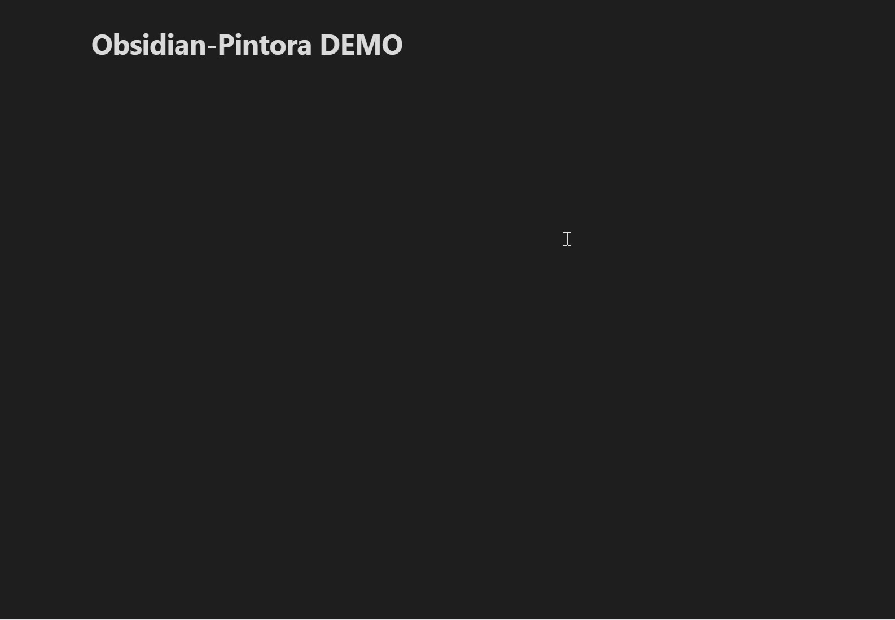
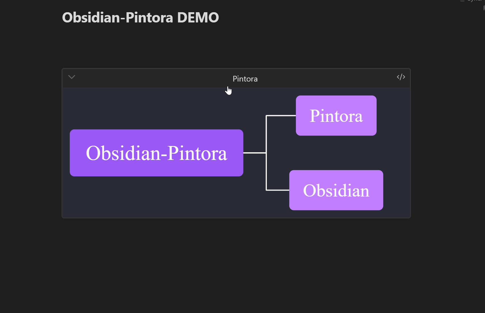
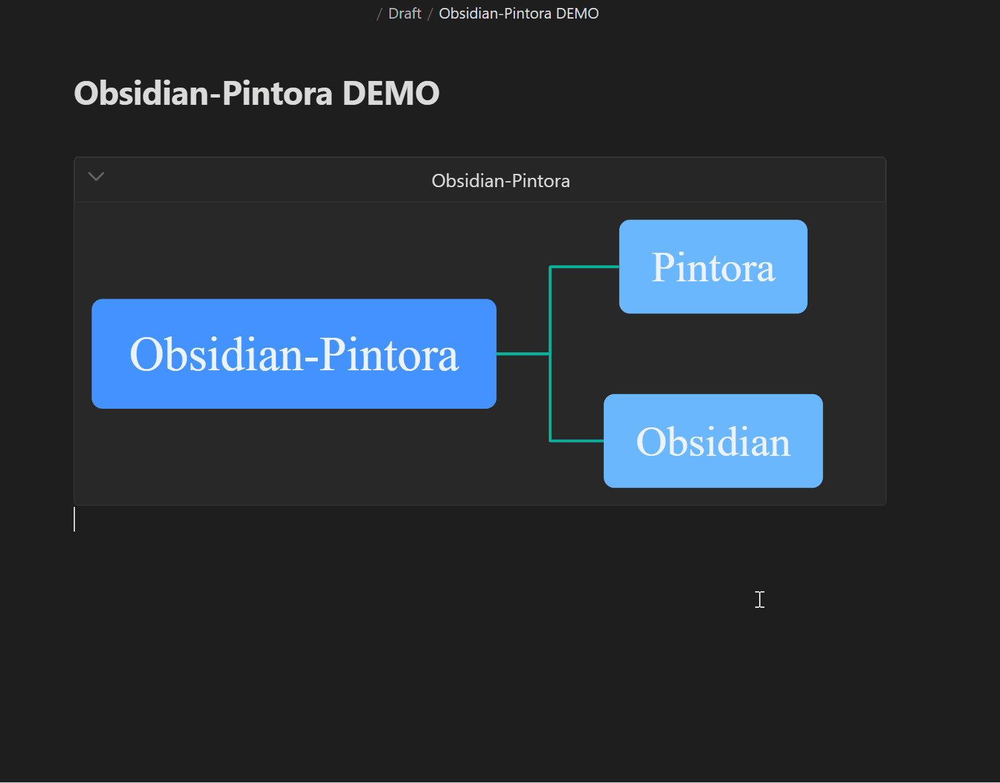

<h2><p align='center'>Obsidian-Pintora</p></h2>

<p align='center'>
  <a href="./README.md">English</a>
  <span>|</span>
  <a href="./README_ZH.md">中文</a>
</p>

---

### Introduction

**Obsidian-Pintora** is an [Obsidian](https://obsidian.md/) plugin based on [Pintora](https://github.com/hikerpig/pintora), which allows users to create diagrams using Pintora syntax directly in the Obsidian editor. It's local, secure, fast, and easy to use.

**Pintora** is a diagramming tool similar to [Mermaid](https://github.com/mermaid-js/mermaid) and [PlantUML](https://github.com/plantuml/plantuml), which generates diagrams by parsing its own language, much like how [Markdown](https://spec.commonmark.org/0.31.2/) works. It presents content in an intuitive and easily understandable way. For a detailed explanation of Pintora's syntax and capabilities, refer to the [Pintora Language Reference Guide](https://pintorajs.vercel.app/docs/intro/).

**Obsidian** is a writing tool that supports editing, previewing, and managing Markdown files. It has a vibrant community with many high-quality community plugins available. The editor supports [CommonMark](https://commonmark.org/), [GitHub Flavored Markdown](https://github.github.com/gfm/), and [LaTeX](https://www.latex-project.org/) syntax, along with some [Obsidian-flavored Markdown extensions](https://help.obsidian.md/Editing+and+formatting/Obsidian+Flavored+Markdown). For more details on the editor's features and usage, check out the [Obsidian User Guide](https://help.obsidian.md/Home).

---

### Features

1. **Diagram Creation**: Parse Pintora language to generate diagrams.
2. **Copy Diagrams**: Copy diagrams to the clipboard in `PNG Base64`, `SVG XML`, and `PNG Blob` formats.
3. **Export Diagrams**: Export diagrams to `.md`, `.png`, `.svg`, `.webp` formats.
4. **Convert to Links**: Convert Pintora code to attachment links by exporting diagrams in `.md`, `.png`, `.svg`, `.webp`, or `base64` formats to a folder, then generating file links to replace the original Pintora code.
5. **Diagram Lightbox**: Center and enlarge diagrams to display them fully and clearly.
6. **Responsive Size**: Dynamically adjust the diagram size based on the original ratio and available space.
7. **Custom Themes**: Choose themes and edge types, and customize theme styles by inputting theme variables.
8. **Other Features**: Return error messages, fold/unfold diagrams, custom diagram titles, and custom attachment names.

---

### Demo

#### Diagram Creation


#### Diagram Lightbox


#### Custom Title


#### Copying, Exporting, and Linking Diagrams


#### Theme and Style


---

### Installation

1. Search for `Pintora` in the Obsidian Community Plugins to install it. (Recommended)
2. Manually download the [plugin package](https://github.com/amiaslee/obsidian-pintora/releases/tag/1.0.0), and place it in the `..\Obsidian Vault\.obsidian\plugins` folder.

---

### Usage

#### Activate Pintora Diagram Functionality

- Start a code block with \`\`\` and enter `pintora` to activate the Pintora diagram drawing feature.
- Supported language labels:
  1. `pintora`: Use the default rendering method, which can be customized in the settings (default is SVG, recommended).
  2. `pintora-svg`: Force rendering as SVG.
  3. `pintora-canvas`: Force rendering as Canvas.

~~~
```pintora
Some Pintora statements written using the Pintora DSL.
```
~~~
#### Custom Titles

- Add a space after the language tag \`\`\`pintora and input `{ title: Example Title }`.
- **Note**: Follow standard JSON formatting as closely as possible. If you need to use commas `,`, enclose the title in `""`, e.g., `{ title: "Hello, World!" }`.

~~~
```pintora { title: Example Title }
Some Pintora statements written using the Pintora DSL.
```
~~~
#### Custom Attachment Names

- Use the title name as the attachment name by adding a space after the language tag \`\`\`pintora and input `{ title: Example Title }`, where *Example Title* is the attachment name.
- Attachments are exported by default to the `attachments` folder in the current file directory, which can be modified in the settings.**Note**: The path starts relative to the current file directory.
- If no title is set, an attachment name is automatically generated according to certain rules.

~~~
```pintora-canvas
activityDiagram
if (Title is set?) then (Yes)
    :Use the set title;
  else (No)
    :Use an auto-generated attachment name;
  endif
```
~~~
#### Diagram Lightbox Functionality

- Click on the diagram to open the lightbox and display the diagram fully and enlarged.

#### Right-Click Menu Functionality

- Right-click on the diagram to activate the context menu.
- Available functions include: `Copy Source Code`, `Copy Diagram`, and `Export Diagram and Link`.
- All features are available in *edit mode*, but the `Export Diagram and Link` function is not available in *preview mode*.

~~~
```pintora-svg
mindmap
* Right-Click Menu
** Copy Source Code
*** Copy the Pintora source code
** Copy Diagram
*** Copy PNG (Base64)
*** Copy SVG (XML)
*** Copy PNG (Blob)
** Export and Link
*** Export .md file
*** Export .png file
*** Export .svg file
*** Export .webp file
*** Export PNG (Base64) file
** Convert to Links
*** Generate .md link
*** Generate .png link
*** Generate .svg link
*** Generate .webp link
*** Generate PNG (Base64) link
```
~~~
#### Custom Theme Styles

- In the settings under the theme variables options, input theme variables in standard JSON format.
- For more details on theme variable settings, refer to [Pintora Theme Configuration](https://pintorajs.vercel.app/docs/configuration/theme/).

---

### Roadmap

1. Fix bugs
2. Track Pintora updates and synchronize versions
3. **No new features will be added**