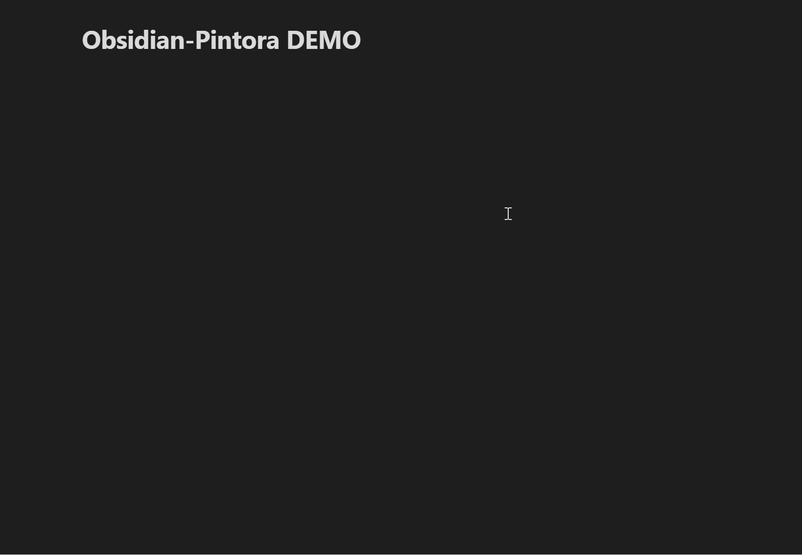
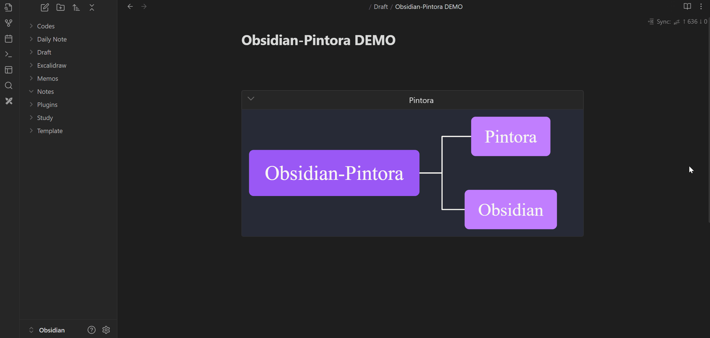
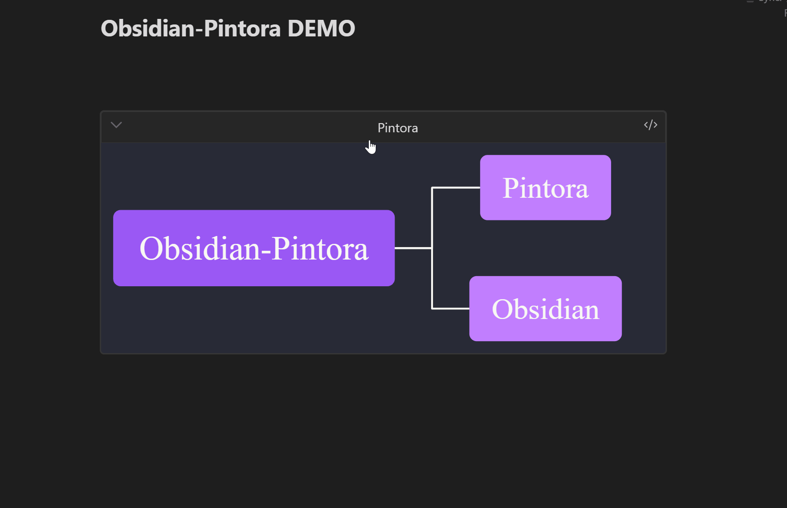
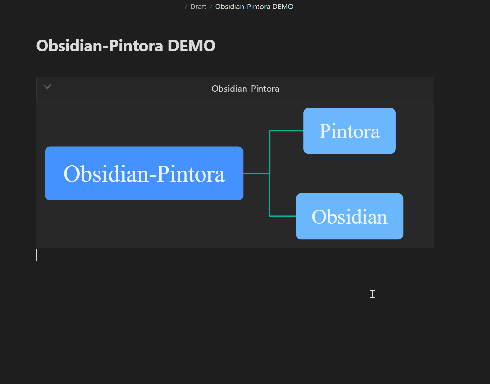

<h2><p align='center'>Obsidian-Pintora</p></h2>

<p align='center'>
  <a href="./README.md">English</a>
  <span>|</span>
  <a href="./README_ZH.md">中文</a>
</p>

---

### 前言

**Obsidian-Pintora** 是一个基于[Pintora](https://github.com/hikerpig/pintora)的[Obsidian](https://obsidian.md/)插件，实现了在Obsidian编辑器中，以Pintora语法来制作图表，它基于本地，安全快速、易于使用。

**Pintora** 是一个类似[Mermaid](https://github.com/mermaid-js/mermaid)、[PlantUML](https://github.com/plantuml/plantuml)的[UML](https://zh.wikipedia.org/wiki/%E7%BB%9F%E4%B8%80%E5%BB%BA%E6%A8%A1%E8%AF%AD%E8%A8%80)图表绘制工具，其运作原理就像[Markdown](https://spec.commonmark.org/0.31.2/)一样，通过解析其独有的语言来生成图表，把内容以直观的、易于理解的方式展现， 如需详细了解该语言的功能和语法，请参阅《[Pintora 语言参考指南》](https://pintorajs.vercel.app/zh-CN/docs/intro/)。

**Obsidian** 是一个可以编辑、预览以及管理Markdown文件的写作软件，其社区活跃，有大量优质的第三方插件以供使用，编辑器提供了对[CommonMark](https://commonmark.org/)、[GitHub Flavored Markdown](https://github.github.com/gfm/)和[LaTeX](https://www.latex-project.org/)语法的支持，并有少量的[Obsidian 风格的 Markdown 语法扩展](https://publish.obsidian.md/help-zh/%E7%BC%96%E8%BE%91%E4%B8%8E%E6%A0%BC%E5%BC%8F%E5%8C%96/Obsidian+%E9%A3%8E%E6%A0%BC%E7%9A%84+Markdown+%E8%AF%AD%E6%B3%95)， 如需详细了解该编辑器的功能和使用方法，请参阅《[Obsidian 使用指南》](https://publish.obsidian.md/help-zh/%E7%94%B1%E6%AD%A4%E5%BC%80%E5%A7%8B)。

---
### 功能

1. **绘制图表**：解析Pintora语言来绘制图表。
2. **复制图表**：将图表以`PNG Base64`、`SVG XML`以及`PNG Blob`的格式复制到剪贴板。
3. **导出图表**：将图表以`.md`、`.png`、`.svg`、`.webp`的格式导出至文件夹。
4. **转为链接**：将Pintora代码转换为附件链接，根据`.md`、`.png`、`.svg`、`.webp`、`base64`的格式导出至文件夹，然后生成文件链接替换掉原来的Pintora代码。
5. **图表灯箱**：将图表居中显示，确保完整呈现的同时，尽可能放大以便查看。
6. **自适应尺寸**：动态的根据图表原始比例以及外部空间大小，自适应调整尺寸。
7. **自定义主题**：可选择主题，边线类型，可输入主题变量定制主题样式。
8. **其他功能**：返回报错信息、图表可折叠展开、自定义图表标题、自定义附件名。

---
### 演示

#### 绘制图表

#### 图表灯箱

#### 自定义标题

#### 图表的复制、导出以及链接

#### 主题和样式


---

### 安装

1. 在Obsidian插件市场中搜索 `Pintora` 进行安装。（推荐）
2. 手动下载[插件包](https://github.com/amiaslee/obsidian-pintora/releases/tag/1.0.0)，然后将插件放入 `..\Obsidian文档库\.obsidian\plugins` 其中的plugins文件夹即可。

---
### 使用方法

#### 激活Pintora图表功能
 
   - 在代码块开头的 \`\`\` 后输入`pintora`即可激活Pintora图表绘制功能。
   - 支持的语言标签：
     1. pintora：使用默认的渲染方式绘图，默认设定可在设置中更改，默认SVG（推荐）。
     2. pintora-svg：强制以SVG的方式渲染。
     3. pintora-canvas：强制以Canvas的方式渲染。
~~~
```pintora
一些使用 Pintora 领域专用语言（DSL）书写的 Pintora 语句。
```
~~~
#### 自定义标题

- 在语言标签 \`\`\`pintora后留下空格` `，然后输入`{ title: 示例标题 }`
- 注意：输入格式应尽可能保持标准JSON，如果需要使用`,`要将标题包裹在`""`中,`{ title: "Hello,World!" }`。
~~~
```pintora { title:示例标题 }
一些使用 Pintora 领域专用语言（DSL）书写的 Pintora 语句。
```
~~~
#### 自定义附件名称

- 根据标题名设置附件名称，在语言标签 \`\`\`pintora后留下空格` `，然后输入`{ title: 示例标题 }`，其中的 *示例标题* 即为附件名。
- 附件导出位置，默认为当前文件目录下的`attachments`文件夹中，可在设置中进行修改，注意，路径是相对与当前文件目录开始。
- 如果没有设置标题，则按照一定规则，自动生成附件名。
~~~
```pintora-canvas
activityDiagram
if (设置了title？) then(是)
    :用设置好的标题;
  else (否)
    :用自动生成的附件名;
  endif
```
~~~

#### 图表灯箱功能

- 单击图表，即可弹出图表灯箱，将图表完整的放大展示。

#### 右键菜单功能

- 在图表上单击右键，即可激活右键菜单。
- 可选的功能有：`复制源码`、`复制图表`、`导出图表并链接`。
- *编辑模式*下可使用全部功能，*预览模式*下无法使用`导出图表并链接`功能。
~~~
```pintora-svg
mindmap
* 右键菜单
** 复制源码
*** 复制 Pintora 源代码
** 复制图表
*** 复制 PNG（Base64）
*** 复制 SVG（XML）
*** 复制 PNG（Blob）
** 导出链接
*** 导出 .md 文件
*** 导出 .png 文件
*** 导出 .svg 文件
*** 导出 .webp 文件
*** 导出 PNG（Base64）文件
** 转为链接
*** 生成 .md 链接
*** 生成 .png 链接
*** 生成 .svg 链接
*** 生成 .webp 链接
*** 生成 PNG（Base64）链接
```
~~~

#### 定制主题样式

- 在设置中的主题变量选项中，输入符合标准JSON格式的主题变量。
- 如需详细了解主题变量的设置，请参阅[《Pintora 主题样式配置》](https://pintorajs.vercel.app/zh-CN/docs/configuration/theme/)。

---
### 项目规划

1. 修复漏洞
2. 跟踪Pintora版本，同步升级
3. **不再开发新功能**
